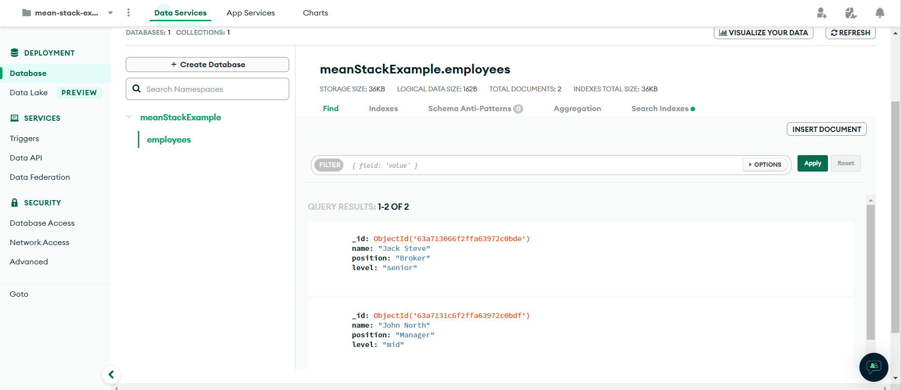
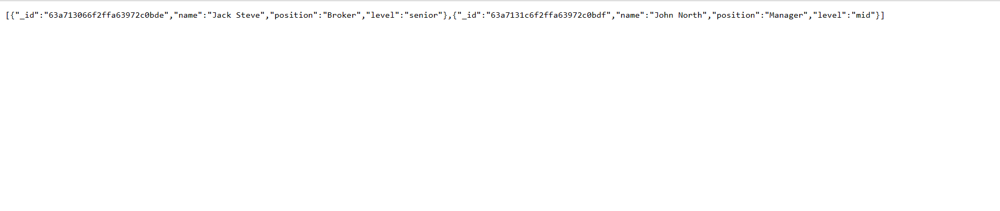
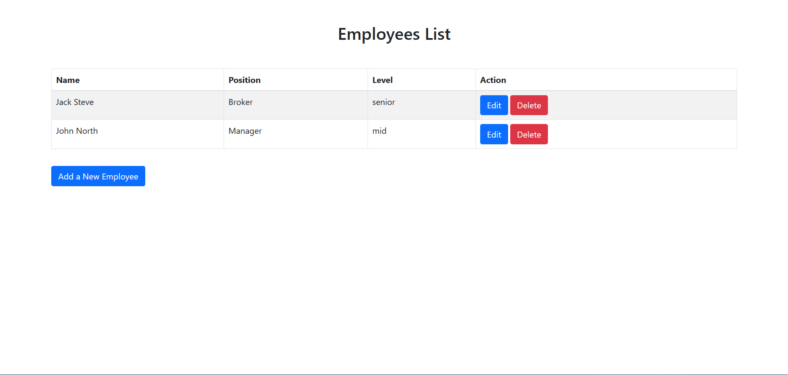

# A basic application using the MEAN technology stack

MEAN technology stack provides a `js` oriented solution to develop a full-stack web applications. It also integrates smoothly with microservices architecture and deployment technologies.

This repo contains a basic web application that utilizes the MEAN stack. It is the code provided by the tutorial, [Mean Stack Tutorial](https://www.mongodb.com/languages/mean-stack-tutorial).

We will be using the MEAN stack to build a simple web application that allows users to create, read, update, and delete (CRUD) a list of items. The application will be a simple employee list.

Here we will go over some of the important commands for working in the MEAN stack environment.

## Screenshots of the application environment
Here are some screenshots of the application environment.
### Screenshot of the ATLAS mongodb database

### Sreenshot of the `Server` application on `localhost:5200`

### Screenshot of the `Client` application on `localhost:4200`
